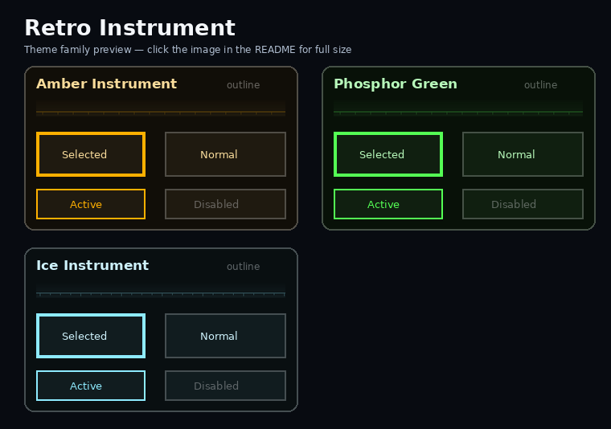
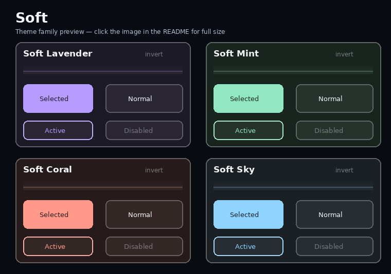
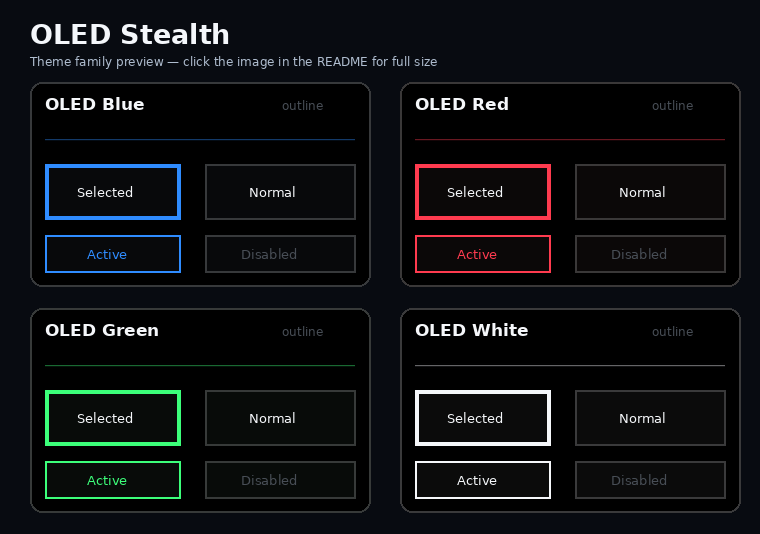
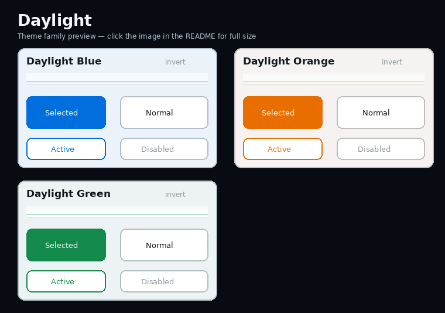
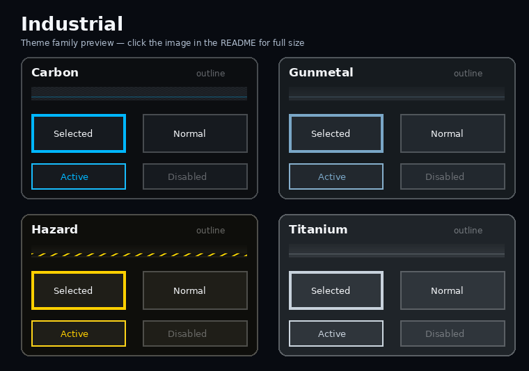
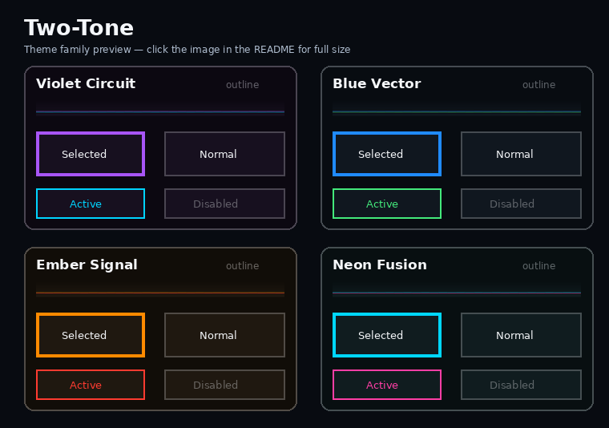
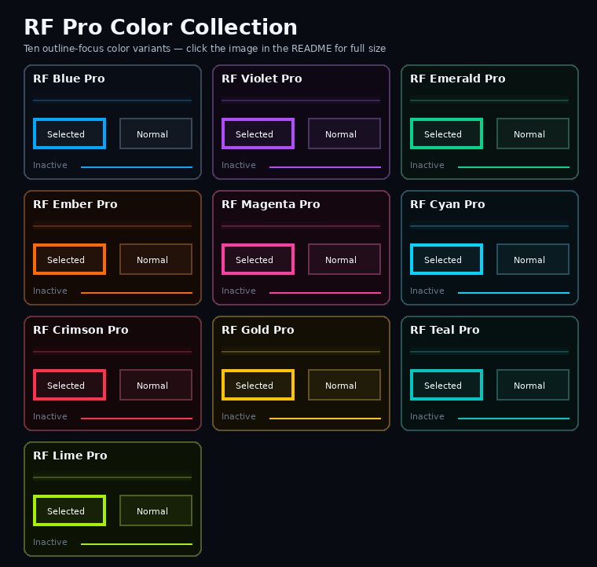

# ETHOS Themes

Custom FrSky ETHOS themes focused on improving Rotorflight RF Suite and the wider ETHOS interface.

## Standalone style collection

These themes use six genuinely different visual styles rather than only changing accent colors. Every theme has a unique ETHOS-safe internal key, a static 784x50 toolbar, and its own individual ZIP.

### Retro Instrument

- **Amber Instrument v1.0.0** — amber cockpit-display styling — [Download](releases/Amber-Instrument-v1.0.0.zip) — [Source](themes/theme-amber-instrument)
- **Phosphor Green v1.0.0** — green CRT-style display — [Download](releases/Phosphor-Green-v1.0.0.zip) — [Source](themes/theme-phosphor-green)
- **Ice Instrument v1.0.0** — cool blue instrument panel — [Download](releases/Ice-Instrument-v1.0.0.zip) — [Source](themes/theme-ice-instrument)

### Soft

- **Soft Lavender v1.0.0** — rounded pastel lavender — [Download](releases/Soft-Lavender-v1.0.0.zip) — [Source](themes/theme-soft-lavender)
- **Soft Mint v1.0.0** — rounded pastel mint — [Download](releases/Soft-Mint-v1.0.0.zip) — [Source](themes/theme-soft-mint)
- **Soft Coral v1.0.0** — rounded pastel coral — [Download](releases/Soft-Coral-v1.0.0.zip) — [Source](themes/theme-soft-coral)
- **Soft Sky v1.0.0** — rounded pastel sky blue — [Download](releases/Soft-Sky-v1.0.0.zip) — [Source](themes/theme-soft-sky)

### OLED Stealth

- **OLED Blue v1.0.0** — near-black with blue focus — [Download](releases/Oled-Blue-v1.0.0.zip) — [Source](themes/theme-oled-blue)
- **OLED Red v1.0.0** — near-black with red focus — [Download](releases/Oled-Red-v1.0.0.zip) — [Source](themes/theme-oled-red)
- **OLED Green v1.0.0** — near-black with green focus — [Download](releases/Oled-Green-v1.0.0.zip) — [Source](themes/theme-oled-green)
- **OLED White v1.0.0** — near-black monochrome styling — [Download](releases/Oled-White-v1.0.0.zip) — [Source](themes/theme-oled-white)

### Daylight

- **Daylight Blue v1.0.0** — light background with blue selection — [Download](releases/Daylight-Blue-v1.0.0.zip) — [Source](themes/theme-daylight-blue)
- **Daylight Orange v1.0.0** — light background with orange selection — [Download](releases/Daylight-Orange-v1.0.0.zip) — [Source](themes/theme-daylight-orange)
- **Daylight Green v1.0.0** — light background with green selection — [Download](releases/Daylight-Green-v1.0.0.zip) — [Source](themes/theme-daylight-green)

### Industrial

- **Carbon v1.0.0** — carbon texture and cyan accent — [Download](releases/Carbon-v1.0.0.zip) — [Source](themes/theme-carbon)
- **Gunmetal v1.0.0** — brushed gunmetal styling — [Download](releases/Gunmetal-v1.0.0.zip) — [Source](themes/theme-gunmetal)
- **Hazard v1.0.0** — black-and-yellow hazard styling — [Download](releases/Hazard-v1.0.0.zip) — [Source](themes/theme-hazard)
- **Titanium v1.0.0** — brushed cool-silver styling — [Download](releases/Titanium-v1.0.0.zip) — [Source](themes/theme-titanium)

### Two-Tone

- **Violet Circuit v1.0.0** — violet focus with cyan active states — [Download](releases/Violet-Circuit-v1.0.0.zip) — [Source](themes/theme-violet-circuit)
- **Blue Vector v1.0.0** — blue focus with green active states — [Download](releases/Blue-Vector-v1.0.0.zip) — [Source](themes/theme-blue-vector)
- **Ember Signal v1.0.0** — orange focus with red active states — [Download](releases/Ember-Signal-v1.0.0.zip) — [Source](themes/theme-ember-signal)
- **Neon Fusion v1.0.0** — cyan focus with magenta active states — [Download](releases/Neon-Fusion-v1.0.0.zip) — [Source](themes/theme-neon-fusion)

## RF Pro color collection

All RF Pro themes use dark square controls, outline focus, clear inactive and disabled states, and a lightweight 784x50 toolbar. Every theme has a separate short ETHOS-safe key, so they can remain installed together.

- **RF Blue Pro v1.0.0** — [Download](releases/RF-Blue-Pro-v1.0.0.zip) — [Source](themes/theme-rfblue-pro)
- **RF Violet Pro v1.0.0** — [Download](releases/RF-Violet-Pro-v1.0.0.zip) — [Source](themes/theme-rf-violet-pro)
- **RF Emerald Pro v1.0.0** — [Download](releases/RF-Emerald-Pro-v1.0.0.zip) — [Source](themes/theme-rf-emerald-pro)
- **RF Ember Pro v1.0.0** — [Download](releases/RF-Ember-Pro-v1.0.0.zip) — [Source](themes/theme-rf-ember-pro)
- **RF Magenta Pro v1.0.0** — [Download](releases/RF-Magenta-Pro-v1.0.0.zip) — [Source](themes/theme-rf-magenta-pro)
- **RF Cyan Pro v1.0.0** — [Download](releases/RF-Cyan-Pro-v1.0.0.zip) — [Source](themes/theme-rf-cyan-pro)
- **RF Crimson Pro v1.0.0** — [Download](releases/RF-Crimson-Pro-v1.0.0.zip) — [Source](themes/theme-rf-crimson-pro)
- **RF Gold Pro v1.0.0** — [Download](releases/RF-Gold-Pro-v1.0.0.zip) — [Source](themes/theme-rf-gold-pro)
- **RF Teal Pro v1.0.0** — [Download](releases/RF-Teal-Pro-v1.0.0.zip) — [Source](themes/theme-rf-teal-pro)
- **RF Lime Pro v1.0.0** — [Download](releases/RF-Lime-Pro-v1.0.0.zip) — [Source](themes/theme-rf-lime-pro)

## Classic theme

**RF Suite Blue v1.0.4** keeps rounded controls and solid blue selected controls.

- [View source](themes/theme-rfsuite-blue)
- [Download previous packaged release v1.0.3](releases/RF-Suite-Blue-v1.0.3.zip)

## Installation

1. Download the desired ZIP or copy its complete theme folder into the transmitter's `scripts` folder.
2. Restart the transmitter.
3. Open **System > General > Theme**.
4. Select the desired theme.

All themes can remain installed together. `main.luac` is intentionally omitted so ETHOS creates a fresh compiled copy.

## Development

- `tools/generate_readme_previews.py` regenerates the six standalone-family README preview images from the actual theme source files.
- `tools/generate_rf_pro_preview.py` regenerates the RF Pro collection preview from the actual RF Pro source files.
- `tools/generate_standalone_themes.py` regenerates the 22 standalone themes and their separate ZIPs.
- `tools/generate_rf_pro_collection.py` regenerates the RF Pro color variants and their separate ZIPs.
