# ETHOS Themes

Custom FrSky ETHOS themes focused on improving Rotorflight RF Suite and the wider ETHOS interface.

**Current packages: v1.2.0, for ETHOS 26.1.0 and newer.** API checked against ETHOS 26.1.2. See [compatibility details and changes](ETHOS26.md). Physical-radio acceptance remains on the [testing checklist](TESTING.md).

The **v1.2.0 readability update** improves foreground contrast and refreshes every collection preview. [See changes and validation](VISUAL_UPGRADE.md).

## Featured: America 250

**America 250 v1.2.0** — commemorating 1776–2026 with midnight navy, ivory stars, flag-red stripes, and gold focus accents. Original toolbar artwork includes a 13-star medallion, anniversary dates, and a bold 250 emblem, drawn separately for both display sizes.

<a href="previews/america250.png">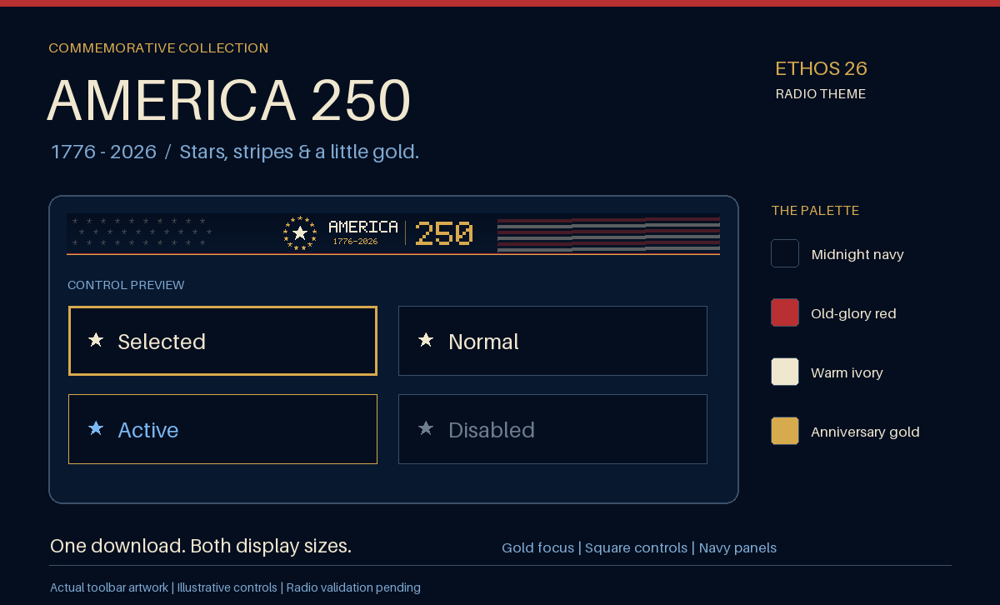</a>

**[Download America 250](releases/America-250-v1.2.0.zip)** · [Theme source and installation](themes/theme-america250)

## Radio compatibility

Every current theme download automatically selects the correct toolbar artwork: **784x50** on 800px radios such as the X20 Pro and X18RS, or **464x50** on standard 480px X18 radios. One ZIP works on both display sizes. Rotorflight and RF Suite Lua files are not modified.

## Cancer Awareness collection

These 10 themes use original generic awareness-ribbon artwork and matching color palettes. Every theme remains a separate download with its own folder, short ETHOS key, source link, and ZIP. No Rotorflight or RF Suite Lua files are modified.

<a href="previews/cancer-awareness.png">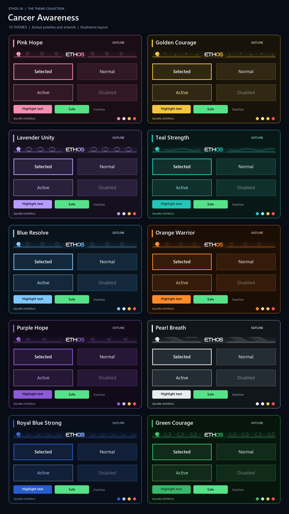</a>

- **Pink Hope v1.2.0** — breast cancer awareness — [Download](releases/Pink-Hope-v1.2.0.zip) — [Source](themes/theme-pink-hope)
- **Golden Courage v1.2.0** — childhood cancer awareness — [Download](releases/Golden-Courage-v1.2.0.zip) — [Source](themes/theme-golden-courage)
- **Lavender Unity v1.2.0** — all-cancers awareness — [Download](releases/Lavender-Unity-v1.2.0.zip) — [Source](themes/theme-lavender-unity)
- **Teal Strength v1.2.0** — ovarian cancer awareness — [Download](releases/Teal-Strength-v1.2.0.zip) — [Source](themes/theme-teal-strength)
- **Blue Resolve v1.2.0** — prostate cancer awareness — [Download](releases/Blue-Resolve-v1.2.0.zip) — [Source](themes/theme-blue-resolve)
- **Orange Warrior v1.2.0** — leukemia awareness — [Download](releases/Orange-Warrior-v1.2.0.zip) — [Source](themes/theme-orange-warrior)
- **Purple Hope v1.2.0** — pancreatic cancer awareness — [Download](releases/Purple-Hope-v1.2.0.zip) — [Source](themes/theme-purple-hope)
- **Pearl Breath v1.2.0** — lung cancer awareness — [Download](releases/Pearl-Breath-v1.2.0.zip) — [Source](themes/theme-pearl-breath)
- **Royal Blue Strong v1.2.0** — colorectal cancer awareness — [Download](releases/Royal-Blue-Strong-v1.2.0.zip) — [Source](themes/theme-royal-blue-strong)
- **Green Courage v1.2.0** — liver cancer awareness — [Download](releases/Green-Courage-v1.2.0.zip) — [Source](themes/theme-green-courage)

## Custom-art collections

These 12 themes add detailed toolbar artwork while remaining normal standalone ETHOS radio themes. Every theme has its own folder, short key, source link, and separate ZIP download. No Rotorflight or RF Suite Lua files are modified.

### Flight Systems

<a href="previews/flight-systems.png">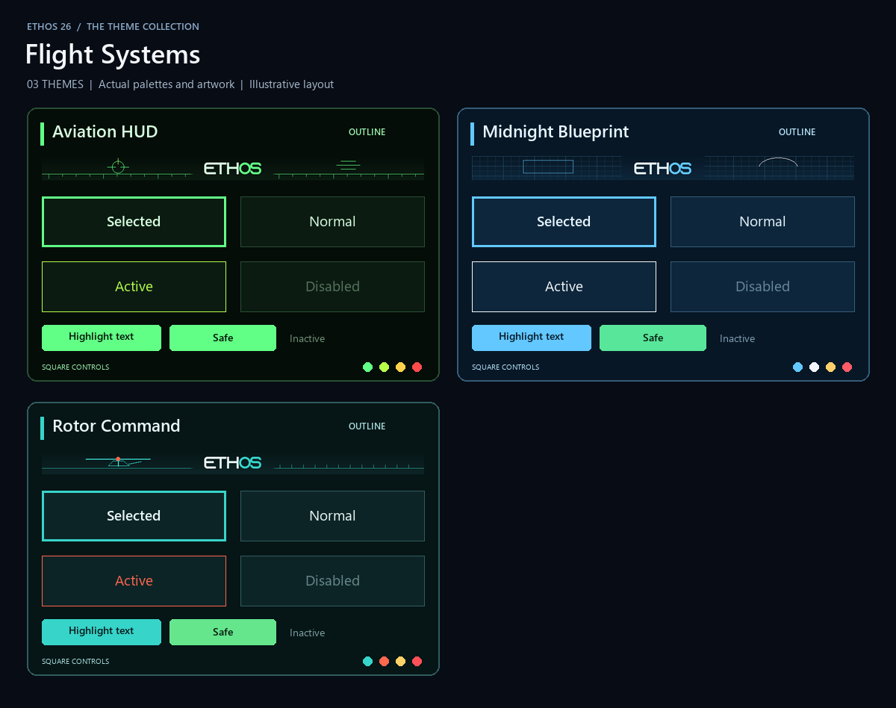</a>

- **Aviation HUD v1.2.0** — targeting reticle, heading ticks, and green HUD styling — [Download](releases/Aviation-HUD-v1.2.0.zip) — [Source](themes/theme-aviation-hud)
- **Midnight Blueprint v1.2.0** — dark technical grid and blueprint markings — [Download](releases/Midnight-Blueprint-v1.2.0.zip) — [Source](themes/theme-midnight-blueprint)
- **Rotor Command v1.2.0** — rotor silhouette and command-panel accents — [Download](releases/Rotor-Command-v1.2.0.zip) — [Source](themes/theme-rotor-command)

### Tactical

<a href="previews/tactical.png">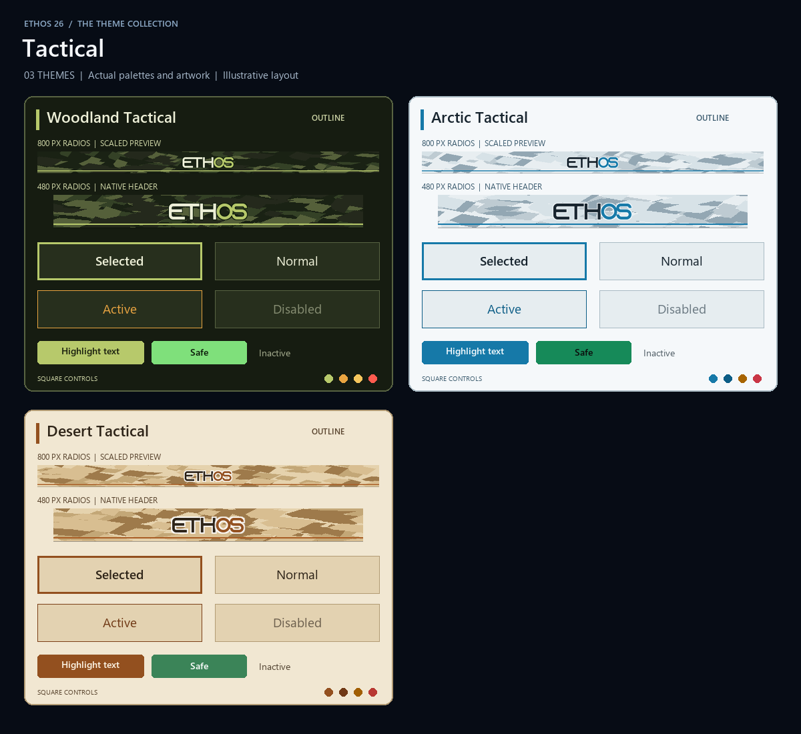</a>

- **Woodland Tactical v1.2.0** — dark woodland camouflage and amber active states — [Download](releases/Woodland-Tactical-v1.2.0.zip) — [Source](themes/theme-woodland-tactical)
- **Arctic Tactical v1.2.0** — pale arctic camouflage with blue controls — [Download](releases/Arctic-Tactical-v1.2.0.zip) — [Source](themes/theme-arctic-tactical)
- **Desert Tactical v1.2.0** — sand camouflage with brown and orange accents — [Download](releases/Desert-Tactical-v1.2.0.zip) — [Source](themes/theme-desert-tactical)

### Cosmic

<a href="previews/cosmic.png">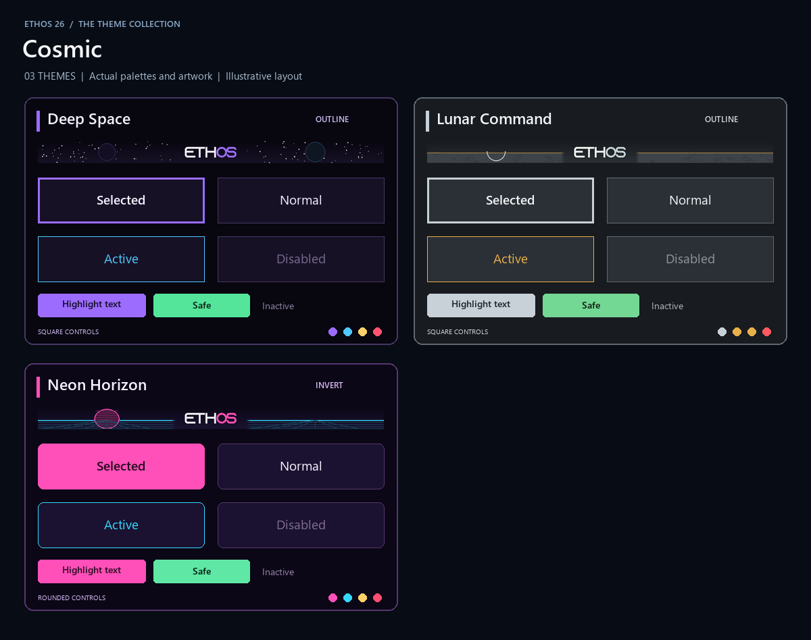</a>

- **Deep Space v1.2.0** — star field, violet nebula tones, and cyan active states — [Download](releases/Deep-Space-v1.2.0.zip) — [Source](themes/theme-deep-space)
- **Lunar Command v1.2.0** — cratered lunar surface and instrument styling — [Download](releases/Lunar-Command-v1.2.0.zip) — [Source](themes/theme-lunar-command)
- **Neon Horizon v1.2.0** — glowing sunset, perspective grid, and neon controls — [Download](releases/Neon-Horizon-v1.2.0.zip) — [Source](themes/theme-neon-horizon)

### Tech & Racing

<a href="previews/tech-racing.png">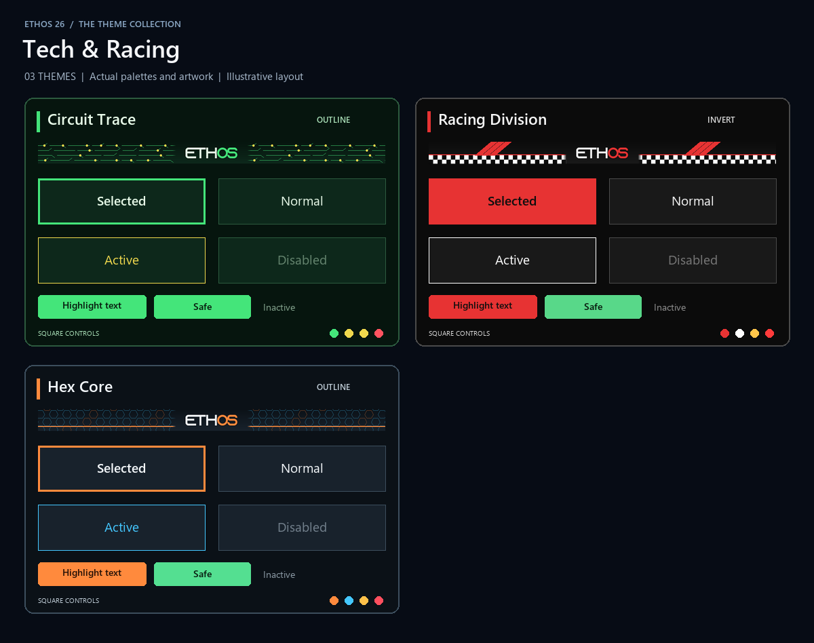</a>

- **Circuit Trace v1.2.0** — circuit-board paths and illuminated connection nodes — [Download](releases/Circuit-Trace-v1.2.0.zip) — [Source](themes/theme-circuit-trace)
- **Racing Division v1.2.0** — checkered pattern, speed stripes, and red race styling — [Download](releases/Racing-Division-v1.2.0.zip) — [Source](themes/theme-racing-division)
- **Hex Core v1.2.0** — illuminated honeycomb pattern with orange and cyan — [Download](releases/Hex-Core-v1.2.0.zip) — [Source](themes/theme-hex-core)

## Elements collection

Four themes named for a natural phenomenon, each built from a different procedural drawing technique rather than a recolored gradient. The artwork is rendered natively at both display sizes, so the fine linework stays sharp on a standard X18 instead of being resampled down from the larger version.

<a href="previews/elements.png">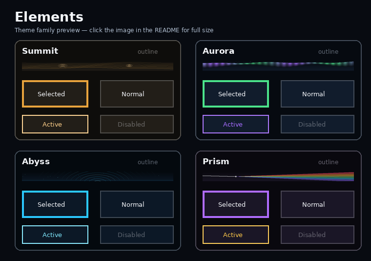</a>

- **Summit v1.2.0** — stacked elevation contours with two peak rings, amber on warm charcoal — [Download](releases/Summit-v1.2.0.zip) — [Source](themes/theme-summit)
- **Aurora v1.2.0** — banded aurora curtains drifting between green and violet — [Download](releases/Aurora-v1.2.0.zip) — [Source](themes/theme-aurora)
- **Abyss v1.2.0** — sonar rings expanding from below the bar, cyan on deep navy — [Download](releases/Abyss-v1.2.0.zip) — [Source](themes/theme-abyss)
- **Prism v1.2.0** — a light beam splitting into its full spectrum, violet focus with gold active states — [Download](releases/Prism-v1.2.0.zip) — [Source](themes/theme-prism)

## Texture collection

Four themes built from a surface texture rather than a scene, each drawn with a different technique. As with the Elements collection the artwork is rendered natively at both display sizes, so the dot screen and the weave stay aligned to the pixel grid on a standard X18.

<a href="previews/texture.png">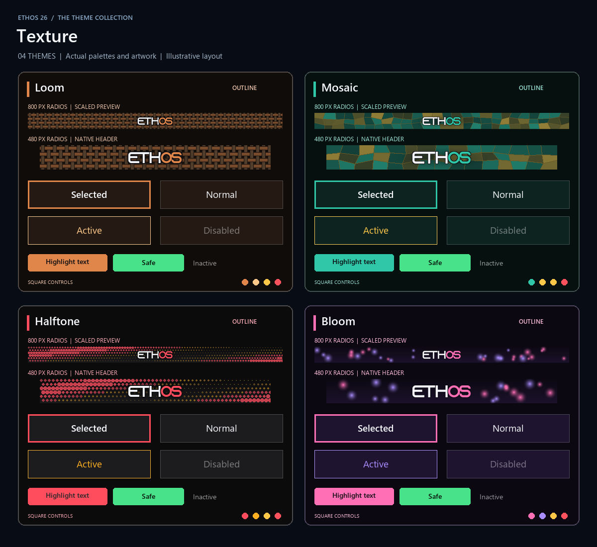</a>

- **Loom v1.2.0** — an over-under basket weave in warm rust and amber — [Download](releases/Loom-v1.2.0.zip) — [Source](themes/theme-loom)
- **Mosaic v1.2.0** — jittered stained-glass cells with lit seams, teal and gold — [Download](releases/Mosaic-v1.2.0.zip) — [Source](themes/theme-mosaic)
- **Halftone v1.2.0** — a dot screen that swells and fades across the bar, crimson focus with amber active states — [Download](releases/Halftone-v1.2.0.zip) — [Source](themes/theme-halftone)
- **Bloom v1.2.0** — soft overlapping bokeh orbs in pink and violet — [Download](releases/Bloom-v1.2.0.zip) — [Source](themes/theme-bloom)

## Standalone style collection

These themes use six genuinely different visual styles rather than only changing accent colors. Every theme has a unique ETHOS-safe internal key, responsive 784x50/464x50 toolbar artwork, and its own individual ZIP.

### Retro Instrument

<a href="previews/retro-instrument.png">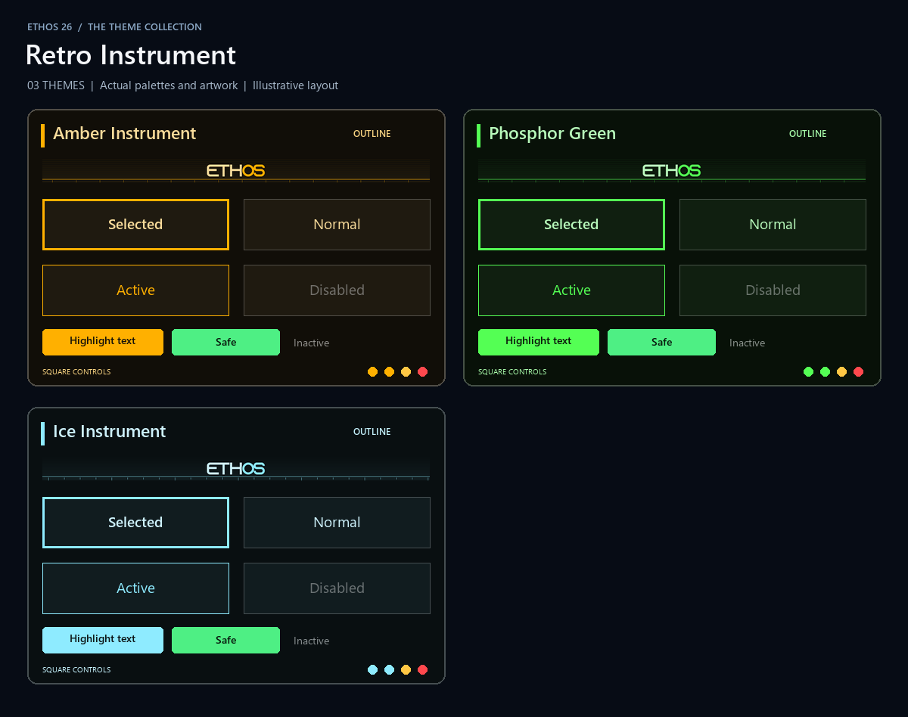</a>

- **Amber Instrument v1.2.0** — amber cockpit-display styling — [Download](releases/Amber-Instrument-v1.2.0.zip) — [Source](themes/theme-amber-instrument)
- **Phosphor Green v1.2.0** — green CRT-style display — [Download](releases/Phosphor-Green-v1.2.0.zip) — [Source](themes/theme-phosphor-green)
- **Ice Instrument v1.2.0** — cool blue instrument panel — [Download](releases/Ice-Instrument-v1.2.0.zip) — [Source](themes/theme-ice-instrument)

### Soft

<a href="previews/soft.png">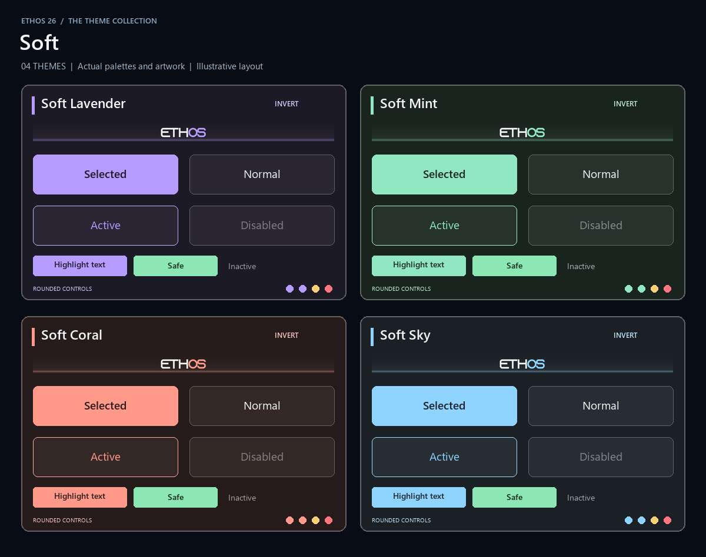</a>

- **Soft Lavender v1.2.0** — rounded pastel lavender — [Download](releases/Soft-Lavender-v1.2.0.zip) — [Source](themes/theme-soft-lavender)
- **Soft Mint v1.2.0** — rounded pastel mint — [Download](releases/Soft-Mint-v1.2.0.zip) — [Source](themes/theme-soft-mint)
- **Soft Coral v1.2.0** — rounded pastel coral — [Download](releases/Soft-Coral-v1.2.0.zip) — [Source](themes/theme-soft-coral)
- **Soft Sky v1.2.0** — rounded pastel sky blue — [Download](releases/Soft-Sky-v1.2.0.zip) — [Source](themes/theme-soft-sky)

### OLED Stealth

<a href="previews/oled-stealth.png">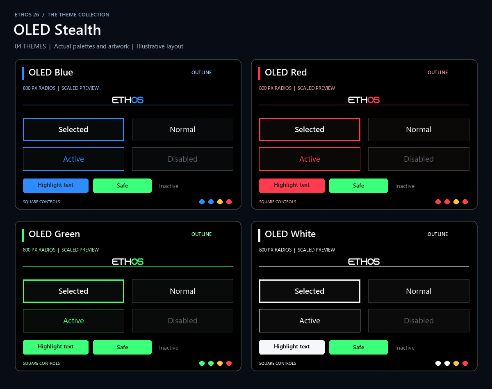</a>

- **OLED Blue v1.2.0** — near-black with blue focus — [Download](releases/Oled-Blue-v1.2.0.zip) — [Source](themes/theme-oled-blue)
- **OLED Red v1.2.0** — near-black with red focus — [Download](releases/Oled-Red-v1.2.0.zip) — [Source](themes/theme-oled-red)
- **OLED Green v1.2.0** — near-black with green focus — [Download](releases/Oled-Green-v1.2.0.zip) — [Source](themes/theme-oled-green)
- **OLED White v1.2.0** — near-black monochrome styling — [Download](releases/Oled-White-v1.2.0.zip) — [Source](themes/theme-oled-white)

### Daylight

<a href="previews/daylight.png">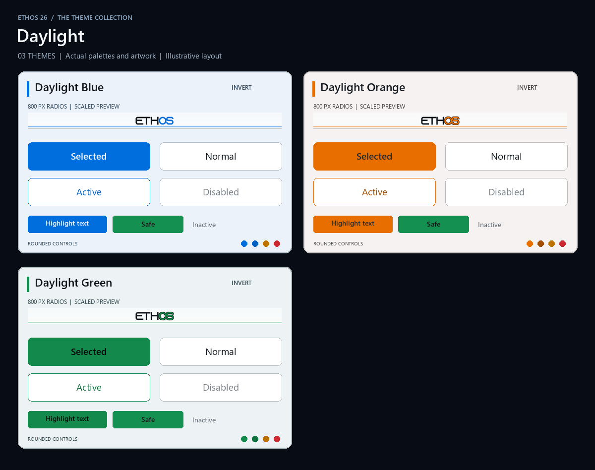</a>

- **Daylight Blue v1.2.0** — light background with blue selection — [Download](releases/Daylight-Blue-v1.2.0.zip) — [Source](themes/theme-daylight-blue)
- **Daylight Orange v1.2.0** — light background with orange selection — [Download](releases/Daylight-Orange-v1.2.0.zip) — [Source](themes/theme-daylight-orange)
- **Daylight Green v1.2.0** — light background with green selection — [Download](releases/Daylight-Green-v1.2.0.zip) — [Source](themes/theme-daylight-green)

### Industrial

<a href="previews/industrial.png">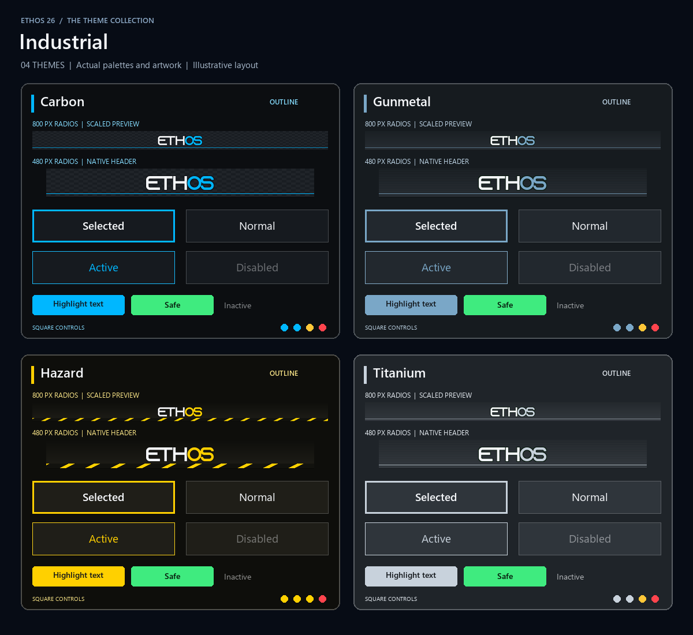</a>

- **Carbon v1.2.0** — carbon texture and cyan accent — [Download](releases/Carbon-v1.2.0.zip) — [Source](themes/theme-carbon)
- **Gunmetal v1.2.0** — brushed gunmetal styling — [Download](releases/Gunmetal-v1.2.0.zip) — [Source](themes/theme-gunmetal)
- **Hazard v1.2.0** — black-and-yellow hazard styling — [Download](releases/Hazard-v1.2.0.zip) — [Source](themes/theme-hazard)
- **Titanium v1.2.0** — brushed cool-silver styling — [Download](releases/Titanium-v1.2.0.zip) — [Source](themes/theme-titanium)

### Two-Tone

<a href="previews/two-tone.png">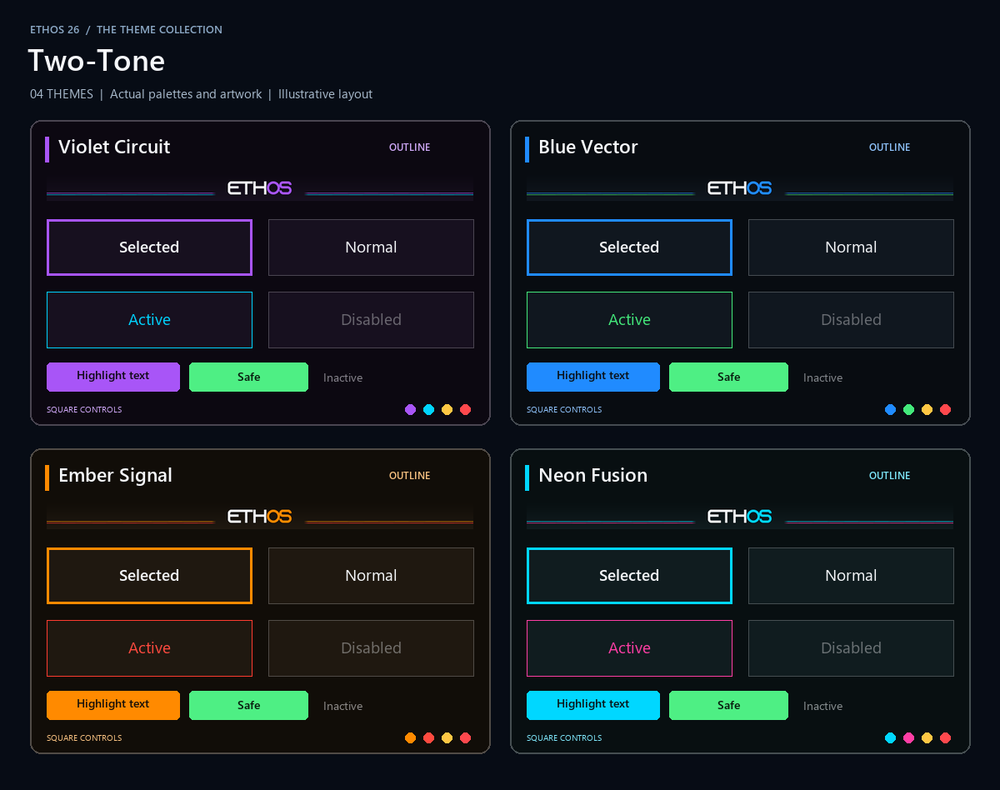</a>

- **Violet Circuit v1.2.0** — violet focus with cyan active states — [Download](releases/Violet-Circuit-v1.2.0.zip) — [Source](themes/theme-violet-circuit)
- **Blue Vector v1.2.0** — blue focus with green active states — [Download](releases/Blue-Vector-v1.2.0.zip) — [Source](themes/theme-blue-vector)
- **Ember Signal v1.2.0** — orange focus with red active states — [Download](releases/Ember-Signal-v1.2.0.zip) — [Source](themes/theme-ember-signal)
- **Neon Fusion v1.2.0** — cyan focus with magenta active states — [Download](releases/Neon-Fusion-v1.2.0.zip) — [Source](themes/theme-neon-fusion)

### Molten

<a href="previews/molten.png">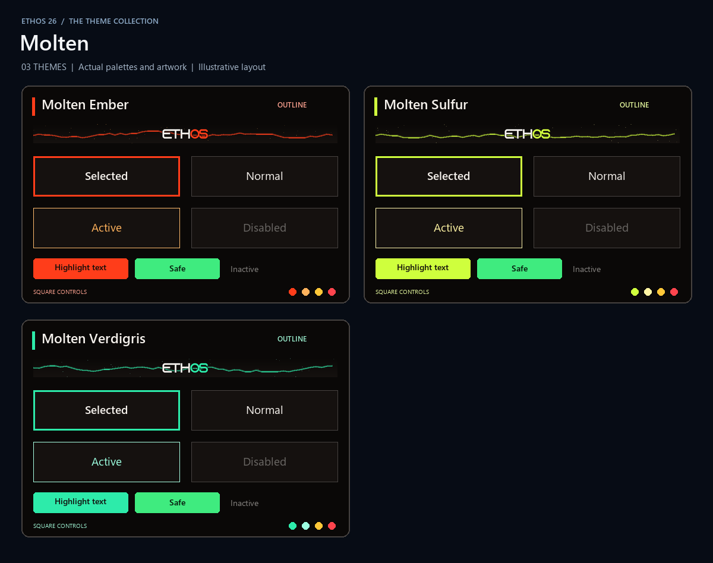</a>

- **Molten Ember v1.2.0** — glowing lava-crack toolbar with a red-orange fissure — [Download](releases/Molten-Ember-v1.2.0.zip) — [Source](themes/theme-molten-ember)
- **Molten Sulfur v1.2.0** — glowing lava-crack toolbar with an acid yellow-green fissure — [Download](releases/Molten-Sulfur-v1.2.0.zip) — [Source](themes/theme-molten-sulfur)
- **Molten Verdigris v1.2.0** — glowing lava-crack toolbar with a cooled teal-green fissure — [Download](releases/Molten-Verdigris-v1.2.0.zip) — [Source](themes/theme-molten-verdigris)

## RF Pro color collection

All RF Pro themes use dark square controls, outline focus, clear inactive and disabled states, and responsive 784x50/464x50 toolbar artwork. Every theme has a separate short ETHOS-safe key, so they can remain installed together.

<a href="previews/rf-pro.png">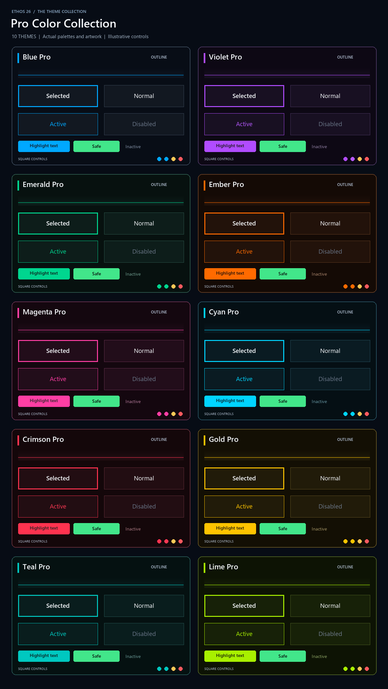</a>

- **RF Blue Pro v1.2.0** — [Download](releases/RF-Blue-Pro-v1.2.0.zip) — [Source](themes/theme-rfblue-pro)
- **RF Violet Pro v1.2.0** — [Download](releases/RF-Violet-Pro-v1.2.0.zip) — [Source](themes/theme-rf-violet-pro)
- **RF Emerald Pro v1.2.0** — [Download](releases/RF-Emerald-Pro-v1.2.0.zip) — [Source](themes/theme-rf-emerald-pro)
- **RF Ember Pro v1.2.0** — [Download](releases/RF-Ember-Pro-v1.2.0.zip) — [Source](themes/theme-rf-ember-pro)
- **RF Magenta Pro v1.2.0** — [Download](releases/RF-Magenta-Pro-v1.2.0.zip) — [Source](themes/theme-rf-magenta-pro)
- **RF Cyan Pro v1.2.0** — [Download](releases/RF-Cyan-Pro-v1.2.0.zip) — [Source](themes/theme-rf-cyan-pro)
- **RF Crimson Pro v1.2.0** — [Download](releases/RF-Crimson-Pro-v1.2.0.zip) — [Source](themes/theme-rf-crimson-pro)
- **RF Gold Pro v1.2.0** — [Download](releases/RF-Gold-Pro-v1.2.0.zip) — [Source](themes/theme-rf-gold-pro)
- **RF Teal Pro v1.2.0** — [Download](releases/RF-Teal-Pro-v1.2.0.zip) — [Source](themes/theme-rf-teal-pro)
- **RF Lime Pro v1.2.0** — [Download](releases/RF-Lime-Pro-v1.2.0.zip) — [Source](themes/theme-rf-lime-pro)

## Classic theme

<a href="previews/classic.png">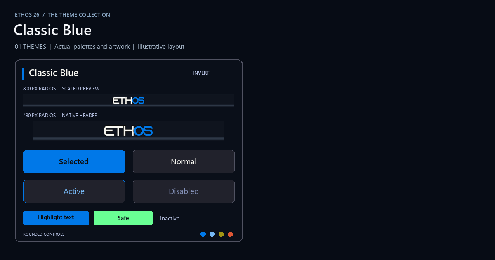</a>

**RF Suite Blue v1.2.0** keeps rounded controls and solid blue selected controls.

- [View source](themes/theme-rfsuite-blue)
- [Download current responsive release v1.2.0](releases/RF-Suite-Blue-v1.2.0.zip)
- [Download previous packaged release v1.0.3](releases/RF-Suite-Blue-v1.0.3.zip)

## Installation

1. Download the desired v1.2.0 ZIP and use **Lua Library > Install from local .zip** in Suite. For manual installation, create its named theme folder inside `scripts` and extract the ZIP contents into it (for example, `scripts/theme-carbon/main.lua`). You can also copy the complete source theme folder into `scripts`.
2. Restart the transmitter.
3. Open **System > General > Theme**.
4. Select the desired theme.

All themes can remain installed together. `main.luac` is intentionally omitted; remove any old compiled copy from the theme being updated so ETHOS creates a fresh one. See [full install and rollback instructions](ETHOS26.md#install-or-update).

## Development

Every generator writes both toolbar sizes, the automatic display-size selection, palette-encoded artwork, and a reproducible ZIP, so regenerating a family never drifts from what is committed.

- `tools/theme_lib.py` holds the shared packaging helpers every generator uses.
- `tools/generate_all_previews.py` refreshes all catalog images from the current Lua palettes and toolbar files, including America 250 and Classic. It does not regenerate the radio artwork.
- `tools/generate_america250_theme.py` regenerates America 250, both native-size toolbar images, its Suite-compatible ZIP, and the featured preview.
- `tools/test_ethos26.py` executes all themes against the documented ETHOS 26 API using Lua runtimes and API stubs. See [test commands](TESTING.md#automated-checks).
- `tools/validate_catalog.py` checks the whole catalog read-only: artwork sizes and encoding, responsive toolbar selection, unique ETHOS keys, and release ZIPs that match their theme folders.
- `tools/rebuild_releases.py` repackages every theme's current release ZIP from its source folder, leaving superseded archives untouched.
- `tools/generate_cancer_awareness_themes.py` regenerates the 10 Cancer Awareness themes, separate ZIPs, and collection preview.
- `tools/generate_custom_art_themes.py` regenerates the 12 custom-art themes, separate ZIPs, and four collection previews.
- `tools/generate_readme_previews.py` regenerates the nine standalone-family README preview images from the actual theme source files.
- `tools/generate_rf_pro_preview.py` regenerates the RF Pro collection preview from the actual RF Pro source files.
- `tools/generate_standalone_themes.py` regenerates the 22 standalone themes and their separate ZIPs.
- `tools/generate_rf_pro_collection.py` regenerates the RF Pro color variants and their separate ZIPs.
- `tools/generate_molten_themes.py` regenerates the 3 Molten themes, their responsive X18/X20 toolbar artwork, and their separate ZIPs.
- `tools/generate_elements_themes.py` regenerates the 4 Elements themes, their natively rendered X18/X20 toolbar artwork, and their separate ZIPs.
- `tools/generate_texture_themes.py` regenerates the 4 Texture themes, their natively rendered X18/X20 toolbar artwork, and their separate ZIPs.
